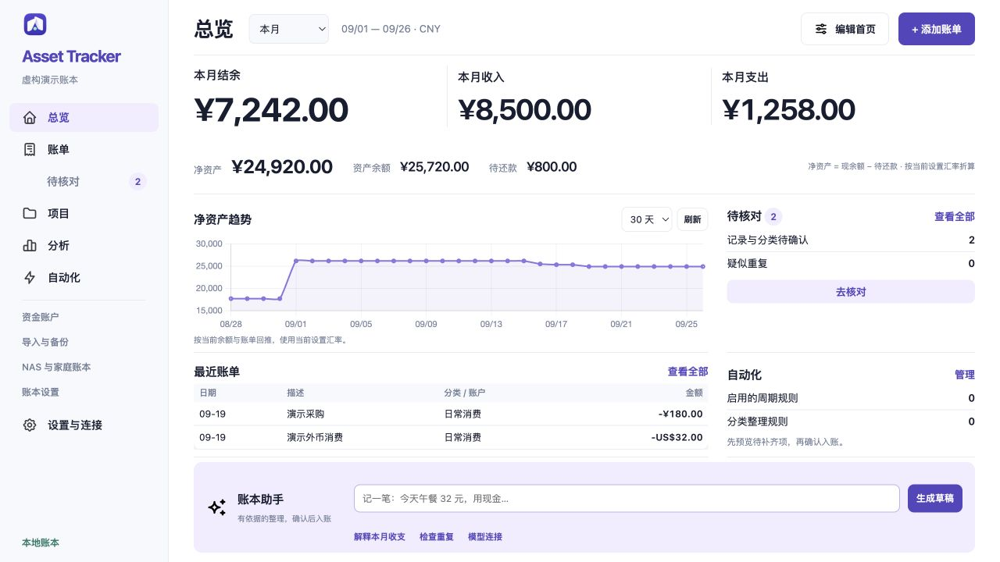
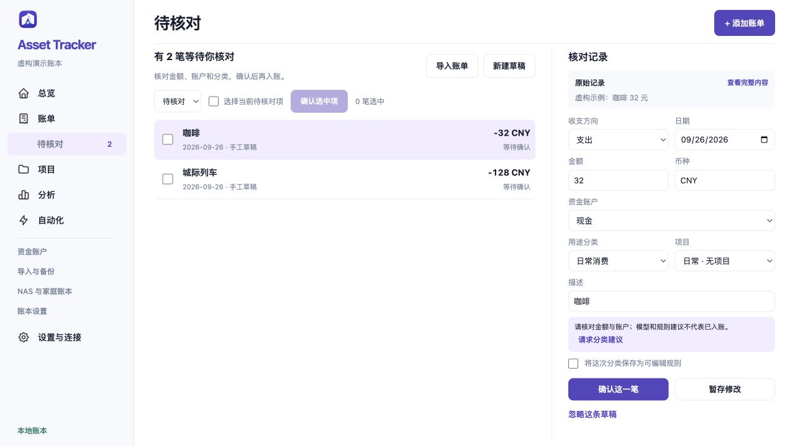

<a id="english"></a>

<p align="center">
  
</p>

<h1 align="center">Asset Tracker</h1>
<p align="center">Your accounts, cash flow and projects. One clear view.</p>

[](#english)
[](#中文)

[](https://github.com/QiushanHuang/Asset-Tracker/releases/latest)
[](https://github.com/QiushanHuang/Asset-Tracker/actions/workflows/ci.yml)
[](#install)
[](#local-or-shared)
[](LICENSE)

A local-first ledger for daily spending, multi-currency accounts and project
costs. See this month's surplus, income and expenses together. Use an optional
local model to prepare entries, check the details, then save. Share a separate
family book on your own NAS when you need collaboration.

**[Download v3.4.0](https://github.com/QiushanHuang/Asset-Tracker/releases/tag/v3.4.0)** ·
[What's new](docs/releases/v3.4.0.md#english) · [User guide](docs/user-guide.md#english)



*The interface is in Simplified Chinese. Screenshots use fictional records.*

## A shorter path from entry to understanding

| What you want to do | How it works |
| --- | --- |
| See the important numbers at a glance | Surplus, income and expenses lead the overview; assets, trends, review items and the assistant share an adaptive screen |
| Arrange the app around your routine | Show, hide, reorder and resize modules; choose a theme, density, primary metric and default period |
| Spend less time entering records | Type a sentence into the optional model assistant, then correct and confirm the proposed fields |
| Review a spreadsheet or statement | Preview Excel/CSV, WeChat, Alipay and supported ICBC/OCBC text PDFs; keep original currencies and review evidence |
| Understand a trip or renovation | Separate project expense categories from the account used to pay; drill into that project's spending |
| Keep recurring work manageable | Preview missing recurring entries, save editable classification rules and inspect assistant run results |

The default home fits a 1280×720 desktop and a 390×844 narrow viewport. More
modules or smaller windows use pages. Long lists paginate; settings and analysis
use named groups. Expanded trees and long source text can scroll within their
own area.

## Install

Download an archive and `SHA256SUMS.txt` from the same
[release](https://github.com/QiushanHuang/Asset-Tracker/releases/tag/v3.4.0).

| Archive | For |
| --- | --- |
| `AssetTracker-v3.4.0-macos-arm64.zip` | Apple silicon, macOS 14 or newer |
| `AssetTracker-v3.4.0-web.zip` | The local web app, with bundled chart, spreadsheet and PDF libraries |
| `AssetTracker-v3.4.0-nas.zip` | NAS service sources, Docker configuration and deployment guide |

The macOS app is **not Developer ID signed or notarized**. Check its checksum
before opening. Export a full JSON backup before replacing an older app, and
keep its existing data directory. The [installation guide](docs/user-guide.md#installation)
also covers an isolated `--preview` book.

To run the web archive, extract it and run this command in its directory:

```sh
python3 -m http.server 8000 --bind 127.0.0.1
```

Open `http://127.0.0.1:8000`. Reuse the same browser profile, hostname and port to
return to the same book.

## Start with one entry

1. Set up **资金账户**: where money is held or owed, with each account's currency.
2. Use **添加账单** for direct entry. For a trip or event, select a project and
   its expense category separately from the funding account.
3. To use a model, open **设置与连接 → 模型与连接**. Enter your running service and
   model, fetch its model list, test structured output, then save your chosen scope.
4. Type a sentence in **账本助手**. Review its amount, date, account and category in
   **待核对**; only confirmation writes it to the ledger.
5. Review the overview or analysis, and export a full JSON backup regularly.

### Model connections

| Provider | Typical local address | Notes |
| --- | --- | --- |
| Ollama | `http://127.0.0.1:11434` | Default adapter; thinking can be disabled for short field extraction |
| LM Studio / compatible API | `http://127.0.0.1:1234/v1` | OpenAI-compatible Chat Completions protocol |
| Cloud API | Your provider's HTTPS base URL | Explicit configuration and data scope; no automatic cloud fallback |

The app does not download or start a model. Model requests use submitted text and
selected account/category candidates, with optional confirmed examples. They do
not include account balances or the full ledger. Mac API keys use Keychain;
browser keys last for the current page session. Models can make mistakes; drafts
remain editable. Cash-flow explanations and duplicate cues are calculated locally.

<details>
<summary>See review and narrow layouts</summary>




</details>

## Four ways to inspect your book

- **History & trends:** balances, net assets, currencies and historical comparisons.
- **Income & spending:** category/project breakdowns and daily cash flow.
- **Future & scenarios:** recurring-rule forecasts and explicit assumptions.
- **Structure & inventory:** composition, inventory anchors and account trees.

Original currencies and calculation assumptions stay visible. Missing exchange
rates remain unconverted. Forecasts describe the recorded rules and assumptions.

## Local or shared

| | Local Mac / web | Optional NAS service |
| --- | --- | --- |
| Storage | Native ledger or browser storage | SQLite in a dedicated persistent volume |
| Workspace, models and full analysis | Available | Use the local app for these features |
| Book visibility | Your local book | Private, shared and family books with explicit invitations |
| Collaboration | No simultaneous shared editing | Owner/editor/viewer roles, conflict checks and recoverable versions |
| Moving data | Full JSON export/import | Import creates a separate private book |

Local and NAS books do not synchronize automatically. A hidden dashboard module
does not change records or permissions. Recurring entries are previewed in the
local app; there is no new always-on NAS scheduler in this release.

Follow the [NAS guide](deploy/ugreen/README.md#english) for Docker deployment and
trusted-LAN/HTTPS choices. v3.4.0 includes a source archive; the existing v3.3.0
prebuilt NAS image remains available from its release.

## Imports, backups and updates

- **Original statements:** WeChat XLSX, Alipay CSV and supported ICBC/OCBC text PDFs
  retain their existing import and audit workflow. Historical-import mode keeps
  current balances unchanged, including subsequent edits/deletions.
- **Review candidates:** equal dates or amounts are clues, not proof of duplication.
  Map the actual funding account and inspect transfers, refunds and reversals.
- **Full JSON:** preserves the formal book, import decisions and confirmed source
  records. Unconfirmed workspace drafts and model settings stay on this device;
  finish or preserve pending drafts before replacing a book or changing devices.
- **Updating:** back up, close the old app, replace the application, then confirm
  the expected book opens. Installing an update does not upload your ledger.

[Release notes](docs/releases/v3.4.0.md#english) · [Changelog](CHANGELOG.md) ·
[Validation](docs/validation/v3.4.0.md) · [Recovery guide](docs/user-guide.md#save-failures-conflicts-and-recovery)

## Development

The shipped UI is at the repository root. `macos-app/Resources/Web` is its staged
copy; `app/` is a separate TypeScript development track. Use Node.js 24.11.0 and
Xcode Command Line Tools for the macOS build.

```sh
npm ci --prefix app
./script/sync_web_assets.sh
ASSET_TRACKER_VERIFY_STAGED=1 node --test tests/*.test.js
node --test tests/nas/*.test.cjs
npm --prefix app test
npm --prefix app run build
python3 script/check-release-docs.py
ASSET_TRACKER_CONFIGURATION=release ./script/build_and_run.sh --stage-only
```

See [Contributing](CONTRIBUTING.md) for native fault-recovery checks and
[Security](SECURITY.md) for reporting issues. Maintained by
[QiushanHuang · Qiushan](https://github.com/QiushanHuang). [MIT](LICENSE).

---

<a id="中文"></a>

# Asset Tracker · 资产记账

[](#english)
[](#中文)

**账户、收支与项目，一眼看清。**

本地优先的个人账本，用来记录日常消费、多币种账户和项目开支。首页集中显示本月结余、收入和支出；可用本机小模型准备账单，核对后入账。需要共同记账时，在自己的 NAS 上另建家庭账本。

**[下载 v3.4.0](https://github.com/QiushanHuang/Asset-Tracker/releases/tag/v3.4.0)** · [更新说明](docs/releases/v3.4.0.md#中文) · [操作手册](docs/user-guide.md#中文)


## 从记录到看明白

| 你想做的事 | 对应功能 |
| --- | --- |
| 打开就看到重点 | 结余、收入、支出醒目呈现；资产、趋势、待核对和助手随窗口适配 |
| 按自己的习惯安排首页 | 模块显示、排序、宽度自由调整，支持主题、密度、主指标和默认期间 |
| 少填几个字段 | 输入一句话，让可选模型准备草稿，再核对金额、日期、账户和分类 |
| 整理表格与原始账单 | Excel/CSV、微信、支付宝和受支持的工行/OCBC 文字 PDF 导入，保留原币与核对依据 |
| 看清一次旅行或装修 | 项目消费分类独立于资金账户，可逐层查看这一件事的开支 |
| 管好重复工作 | 预览周期待补齐项、编辑分类规则、查看助手执行结果 |

默认首页在 **1280×720 桌面和 390×844 窄屏**可一屏显示。更多模块或更小窗口使用分页；长列表分页，设置与分析按组切换。展开的账户树和长原文保留区域滚动。

## 安装与开始使用

从同一个 [Release](https://github.com/QiushanHuang/Asset-Tracker/releases/tag/v3.4.0) 下载对应压缩包和 `SHA256SUMS.txt`：

| 下载包 | 用途 |
| --- | --- |
| `AssetTracker-v3.4.0-macos-arm64.zip` | Apple 芯片，macOS 14 或以上 |
| `AssetTracker-v3.4.0-web.zip` | 本地网页，包含图表、表格和 PDF 依赖 |
| `AssetTracker-v3.4.0-nas.zip` | NAS 服务源码、Docker 配置和部署指南 |

Mac 包**未做 Developer ID 分发签名和公证**。打开前核对校验值；升级前导出完整 JSON 并关闭旧版 App，保留原数据目录。[安装手册](docs/user-guide.md#installation)也说明了独立 `--preview` 预览方式。

网页包解压后，在该目录运行 `python3 -m http.server 8000 --bind 127.0.0.1`，打开 `http://127.0.0.1:8000`。继续使用相同浏览器、地址和端口，才能回到同一份账本。

1. 在 **资金账户** 设置钱存在哪里、欠在哪里，以及账户币种。
2. 点 **添加账单** 直接记录；旅行或活动可另选项目与消费分类。
3. 想用模型时，在 **设置与连接 → 模型与连接** 填写已经运行的服务和模型，获取列表、测试结构输出，再保存授权范围。
4. 在 **账本助手** 输入一句话，进入 **待核对** 修改字段，确认后写入账本。
5. 在总览或分析中查看变化，定期导出完整 JSON 备份。

### 模型接入

Ollama 默认地址为 `http://127.0.0.1:11434`；LM Studio / 兼容接口通常为 `http://127.0.0.1:1234/v1`。也可明确配置 HTTPS 云端 API。本机失败不会自动转发云端，App 不负责下载或启动模型。

请求使用主动提交的文本、账户/分类候选，以及可选的已确认分类样例，不发送账户余额或完整账本。Mac 密钥存入钥匙串，浏览器密钥只在当前页面会话保留。模型可能出错，草稿始终可编辑；收支解释和重复线索由本地代码计算。

## 四类分析，保留完整口径

- **历史与趋势**：余额、净资产、币种与时点对比。
- **收支去向**：分类、项目与逐日现金流。
- **未来与假设**：按已登记周期规则和明确假设推演。
- **结构与盘点**：资产构成、盘点锚点与账户树。

原币与计算口径始终可查；缺少汇率的金额保持未折算。预测反映已登记的规则和假设。

## 本地自用，也可另建家庭账本

本地 Mac/网页提供完整工作区、模型与分析；NAS 提供私有、共同、家庭账本，以及所有者/编辑者/查看者权限、冲突检查与版本恢复。两者不会自动同步，向 NAS 导入 JSON 会创建独立私有账本。

隐藏首页模块只改变显示。周期待补齐项由本地 App 预览，本版没有新增 NAS 常驻调度器。部署步骤见 [NAS 指南](deploy/ugreen/README.md#中文)。v3.4.0 提供 NAS 源码包；原 v3.3.0 预构建镜像仍可在对应 Release 下载。

## 导入、备份与更新

- 原始微信、支付宝和银行账单沿用导入核对流程。历史导入默认不改当前余额，后续编辑/删除也保留这个含义。
- 同日同金额只是重复线索。按真实资金账户映射，单独判断转账、退款与冲正。
- 完整 JSON 保留正式账本、导入决定与已确认来源。未确认工作区草稿和模型设置保留在本设备，换设备或替换账本前，先处理需要保留的草稿。
- 更新前备份、关闭旧版、替换 App，再确认账本正常打开。安装更新不会上传个人账本。

[更新说明](docs/releases/v3.4.0.md#中文) · [更新日志](CHANGELOG.md) · [验证记录](docs/validation/v3.4.0.md) · [操作手册](docs/user-guide.md#中文)

开发命令见上方 [Development](#development)。维护者：[QiushanHuang · Qiushan](https://github.com/QiushanHuang)；许可：[MIT](LICENSE)。
