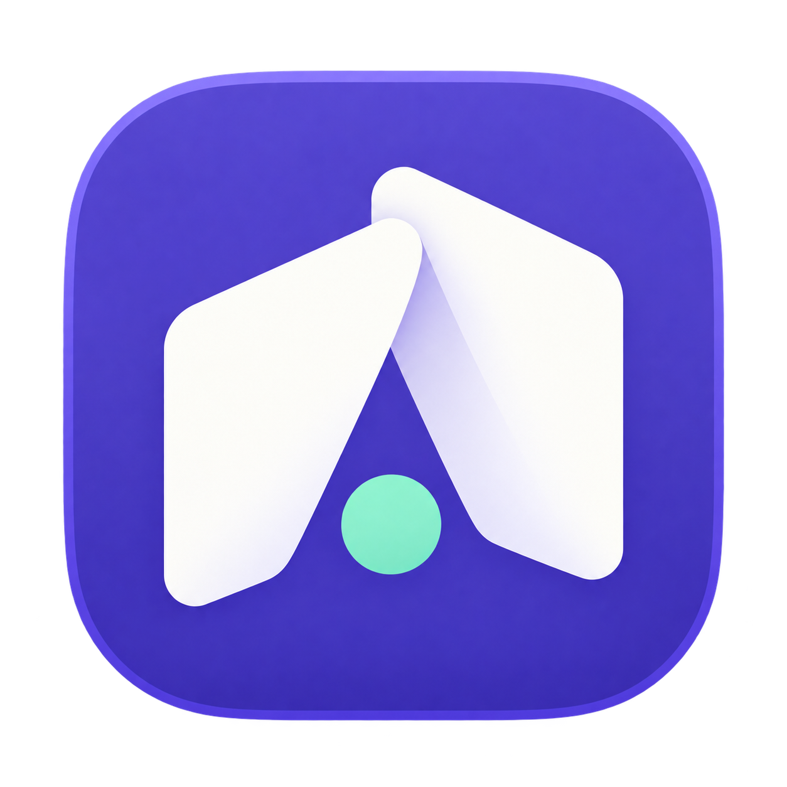
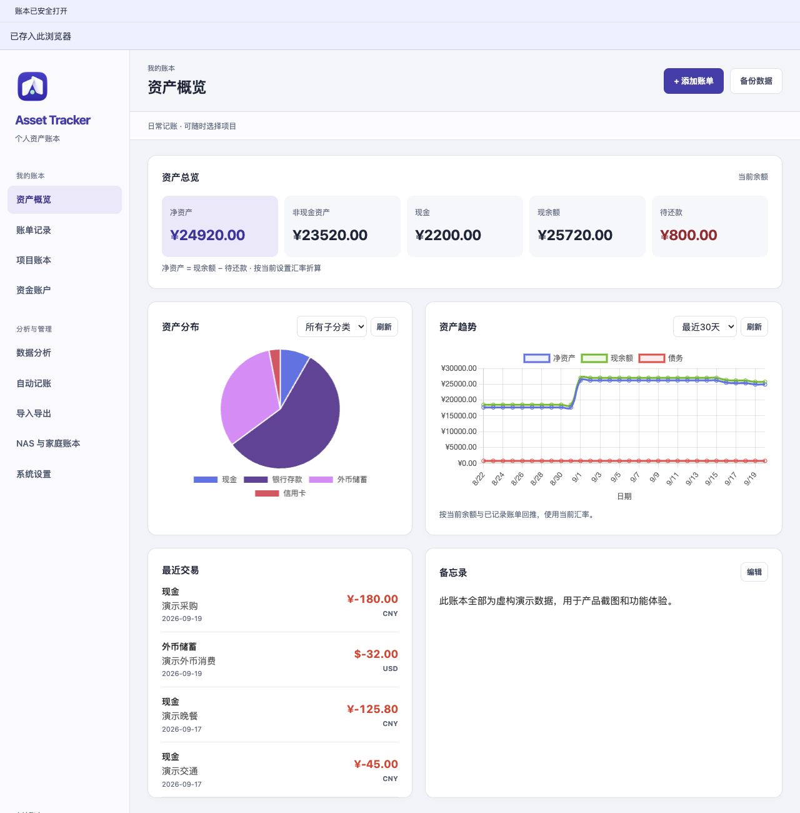
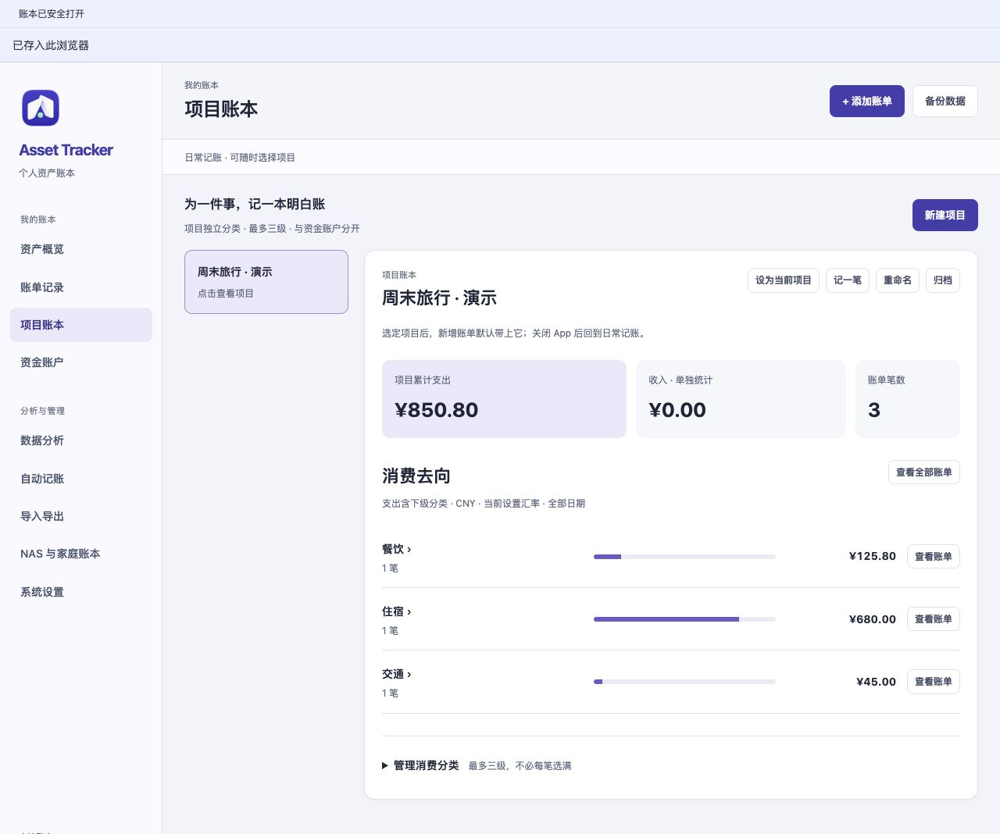
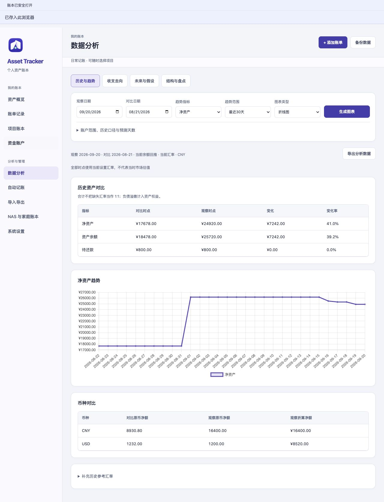

<a id="english"></a>

<p align="center">
  
</p>

# Asset Tracker

[](#english)
[](#中文)

[](https://github.com/QiushanHuang/Asset-Tracker/releases)
[](https://github.com/QiushanHuang/Asset-Tracker/actions/workflows/ci.yml)
[](#install)
[](#choose-where-your-book-lives)
[](https://github.com/QiushanHuang)
[](LICENSE)

**A local-first asset ledger, with optional shared books on your own NAS.**
Keep accounts, everyday spending and travel projects organized. Understand your
balances with four analysis workspaces, or invite family members to a separate
NAS book while keeping personal books private.

## Why choose Asset Tracker

Choose it when recording a payment is only the start: you also want to know
**which account changed, what the money was for, and who should be able to see it**.
Local use needs no hosted account; shared books run on a NAS you control.

| If your current workflow has this problem… | What changes here |
| --- | --- |
| Balances, daily spending and trip costs live in separate sheets, so you keep reconciling them manually | One transaction can identify its funding account, project and expense category; the local analysis reads those records together |
| A broad “travel” category cannot explain one particular trip or renovation | Each project gets its own category tree and drill-down totals, while your funding accounts keep their own meaning |
| Sharing a household book makes personal privacy an ongoing chore | Personal NAS books stay private; shared/family books use explicit invitations and roles, and household summaries include only selected shared books |
| Importing or saving leaves you unsure what changed, whether a row was duplicated, or whether a save completed | Import previews show errors and duplicates; native saves have confirmation; NAS conflicts keep your input, and retrying an uncertain save avoids duplicate records |
| A converted total looks precise but the rate or forecast assumptions are unclear | Original currencies remain visible, missing rates stay unconverted, and analysis states its calculation assumptions |

Enter each purchase once. Review it by account, project or period, and keep
personal records and shared household spending in separate books.

### Where it fits

- **Everyday and multi-currency life:** record expenses across cash and bank
  accounts, keep original currencies, and inspect changes in net assets.
- **A trip, event or renovation:** create one project, record transport/food/
  accommodation separately, then see where that particular budget went.
- **A household with personal boundaries:** keep individual records private,
  invite family into a common NAS book, and review selected household spending.
- **Moving away from a collection of spreadsheets:** preview Excel/CSV before
  adding records and keep complete, portable JSON backups afterward.



*Screenshots use fictional demo data.*

## Install

Download **v3.3.0** from [Releases](https://github.com/QiushanHuang/Asset-Tracker/releases/latest).

| Download | Use it for |
| --- | --- |
| `AssetTracker-v3.3.0-macos-arm64.zip` | macOS 14 or newer on Apple silicon |
| `AssetTracker-v3.3.0-web.zip` | The complete local web interface, including bundled chart and spreadsheet libraries |
| `AssetTracker-v3.3.0-nas.zip` | NAS application sources, Docker configuration and deployment instructions |
| `AssetTracker-v3.3.0-nas-linux-amd64.tar.gz` | Prebuilt image for an x86-64 NAS; useful when the NAS cannot pull build images |
| `SHA256SUMS.txt` | SHA-256 checksums for these downloads |

The app interface is in Simplified Chinese. Choose English or Chinese in this README and the operating guides.

The macOS download is **unsigned and not notarized**. After checking its checksum
and unzipping it, approve it in macOS Privacy & Security if prompted. See the
[user guide](docs/user-guide.md#installation) for installation and updates.
Use the web package on other computers.

### Run the local web interface

Extract the web archive, open a terminal in its directory, then run:

```sh
python3 -m http.server 8000 --bind 127.0.0.1
```

Open `http://127.0.0.1:8000`. Keep using the same browser profile and address to
return to the same book. Start the local server whenever you use this package.

### Build the macOS application

With Xcode Command Line Tools installed:

```sh
git clone https://github.com/QiushanHuang/Asset-Tracker.git
cd Asset-Tracker
ASSET_TRACKER_CONFIGURATION=release ./script/build_and_run.sh --stage-only
open dist/AssetTracker.app
```

## Start here

1. Open **Funding accounts / 资金账户** and set up where money is held.
2. Use **Add transaction / 添加账单** to record an income or expense. The quick
   form accepts a positive amount and a separate income/expense choice.
3. For a trip, renovation or event, create a **Project book / 项目账本**. Choose
   its purpose categories separately from the account used to pay.
4. Use **Save and continue / 保存并继续** for the next item; the form clears only
   after the save is acknowledged.
5. Review **Data analysis / 数据分析**, then export a complete JSON backup.

| Term | Meaning |
| --- | --- |
| Funding account | Where money is stored or owed |
| Project | Which trip, event or activity a transaction belongs to |
| Expense category | What the money was spent on, within that project |
| Personal/shared/family book | A NAS book's membership and visibility boundary |

Use projects to organize activities within a book. Use separate NAS books and
member permissions to choose who can see those records.

<details>
<summary>See a project bookkeeping example</summary>



</details>

## Four analysis workspaces

- **History & trends** — balances, net assets, currencies and historical comparisons.
- **Income & spending** — category/project breakdowns and daily or periodic cash flow.
- **Future & scenarios** — deterministic forecasts from recorded rules and explicit assumptions.
- **Structure & inventory** — composition, inventory anchors, category trees and summaries.

Enter the exchange rates you want to use, then review the rate and calculation
notes beside each analysis. Amounts with missing rates stay separate so you can
complete the rates before comparing totals. Forecasts follow your rules and
assumptions; update them as your plans change.

<details>
<summary>See the local analysis workspace</summary>



</details>

## Choose where your book lives

| Capability | Local macOS / local web | NAS collaboration |
| --- | --- | --- |
| Personal asset book | Yes | Yes, with a separate service account |
| Project/category management and four analysis workspaces | Full local interface | Categories from imported projects; use the local app for detailed analysis and category setup |
| Recurring rules | Local rule management and catch-up | Rule data stays in JSON exports; recurring bookkeeping runs in the local app |
| Members and shared books | No | Owner, editor and viewer roles; private books cannot be shared |
| Import/export | Excel, CSV and full JSON | Full JSON, imported as a new private book |
| Storage | Native macOS ledger / browser localStorage | SQLite on your NAS's persistent Docker volume |
| Synchronization | Move a book deliberately with JSON export/import | Online shared books, revision checks and duplicate-safe retries |

### Personal, shared and family books

Personal NAS books are visible only to their owner. Shared and family books
require an invitation. Owners manage members, editors can change records, and
viewers can read and export. Invitations expire after 24 hours and can be used
once; removed members lose service access immediately.

Select the shared/family books you want to include in a household summary. It
shows income, spending and net cash flow by currency, with paired internal
transfers left out of income/spending. Use transfers to move money between two
non-liability accounts in the same currency within one book.

### Open from a UGREEN NAS

Use the [NAS deployment guide](deploy/ugreen/README.md#english) to deploy the
service and create a **Family Ledger / 家庭记账** Docker desktop shortcut.
The shortcut opens the bookkeeping page, sometimes in your system browser.
The **trusted-LAN** setup works with your NAS’s local address, without buying a domain.

For the LAN template, enter your NAS’s private IPv4 address and open the page
from that address. **HTTP traffic is unencrypted**, so use it on a trusted local
network and keep its port off the public internet. Use HTTPS for other remote connections.

On a phone, open the NAS entry from the same trusted network. Before relying on
a different UGREENlink or remote-access route, check opening, signing in and
saving a record through that route.

## Import, export and recovery

- **Excel / CSV append:** review the preview first. Invalid dates, amounts,
  missing/ambiguous accounts and invalid project references block the import.
  Identical stable IDs are skipped; changed content under the same ID is a conflict.
  Content-only duplicates require an explicit choice.
- **Excel export:** inspect transactions and re-import supported rows. Use full
  JSON for a complete book backup, internal transfers and legacy debt records.
- **Full JSON:** preserves the local book's accounts, transactions, projects,
  rules and settings. Local replacement first requests an export of the current
  book. Confirm that the backup file was actually saved.
- **NAS JSON:** imports into a new private book. Full service backups use the
  [SQLite backup procedure](deploy/ugreen/README.md#backup-and-restore), which also
  preserves users, memberships and revision history.

On macOS, the app confirms when your book has been saved. If a book cannot be
opened, the recovery screen helps you choose the next step while preserving the
original file. On NAS, a conflicting edit keeps your draft so you can review the
latest book and try again. If a connection drops during saving, retry without
creating a duplicate record. Restoring an earlier version keeps current member
permissions and adds the restored content to the version history.

## What's new in v3.3.0

Import original WeChat/Alipay exports and supported ICBC/OCBC PDF statements.
Keep original currencies, review suspected duplicates, and return to saved
review decisions later. Historical imports preserve current account balances.
PDF files are parsed on your device; scanned or inconsistent statements are rejected.

See [release notes](docs/releases/v3.3.0.md#english), the [changelog](CHANGELOG.md)
and the [user guide](docs/user-guide.md#english) for upgrade steps and feature details.

## Develop and contribute

The shipped web UI lives at the repository root; the macOS build stages those files.
`app/` contains the separate TypeScript/IndexedDB development track and shared test dependencies. Use Node.js 24.11.0 for the checks and NAS service.

```sh
npm ci --prefix app
./script/sync_web_assets.sh
ASSET_TRACKER_VERIFY_STAGED=1 node --test tests/*.test.js
node --test tests/nas/*.test.cjs
npm --prefix app test
npm --prefix app run build
swift build --package-path macos-app --product AssetTrackerFaultHarness
ASSET_TRACKER_FAULT_HARNESS="$(swift build --package-path macos-app --show-bin-path)/AssetTrackerFaultHarness" \
  swift test --package-path macos-app
```

[Contributing](CONTRIBUTING.md) · [Security](SECURITY.md) ·
[Third-party notices](THIRD_PARTY_NOTICES.md) · [Branding](docs/branding.md)

Created and maintained by **[Qiushan / @QiushanHuang](https://github.com/QiushanHuang)**.
See [contributors](CONTRIBUTORS.md). Licensed under the [MIT License](LICENSE).

---

<a id="中文"></a>

## 中文

[](#english)
[](#中文)

**以本地存储为基础的资产账本，也可以在自己的 NAS 上记共同账、家庭账。**
把资金账户、日常收支和旅行项目分清楚，用四个分析面板理解资产变化。
需要一起记账时，再邀请家人加入单独的 NAS 账本，个人账本默认私有。

### 为什么选它

当你不满足于“记下一笔花了多少钱”，还想同时看清**钱从哪里出、花在什么事情上、谁可以看到这笔账**时，这个软件就有了价值。
本地使用不需要注册云端账户；共同账本可以放在自己的 NAS 上。

| 现有记账方式让你遇到的麻烦 | Asset Tracker 的对应优势 |
| --- | --- |
| 余额、日常流水和旅行费用散在不同表格里，经常需要手工对账 | 一笔记录分别关联资金账户、项目和消费分类，本地分析直接使用同一批数据 |
| 一个笼统的“旅游”分类，算不清某次旅行、装修或活动具体花在哪里 | 每个项目有自己的分类树和逐层汇总，不把用途和银行账户混在一起 |
| 想共同记家庭账，又不想把全部个人记录给家人看 | NAS 个人账本默认私有，共同/家庭账本通过邀请分配权限，家庭汇总只包含主动选择的共享账本 |
| 导入怕重复、保存后不知道是否成功，多人修改又担心相互覆盖 | 先预览错误与重复项；原生保存有确认；NAS 修改冲突时保留输入，保存结果不明确时可重试，避免重复记账 |
| 折算总额和预测看起来很精确，却不知道汇率或计算假设 | 保留原币，缺失汇率明确标成未折算，分析展示计算口径和假设 |

一笔账只录一次，回看时按账户、项目或时间查看。个人记录留在自己的账本，家庭开销放进共享账本。

### 快速看看适不适合你

- **日常生活与多币种收支**：现金、银行卡分别记录，原币保留，回看净资产变化。
- **旅行、活动或装修**：建一个项目，分清交通、餐饮、住宿等用途，结束后算清这一件事的开销。
- **家庭共同记账**：个人账目保持私有，邀请家人记录共同支出，再按所选账本查看家庭汇总。
- **从多份表格迁移**：先检查 Excel/CSV 预览，再追加记录，并用完整 JSON 保留可迁移的备份。


*截图使用虚构演示数据。*

### 下载安装

从 [Releases](https://github.com/QiushanHuang/Asset-Tracker/releases/latest) 下载 **v3.3.0**：

| 文件 | 用途 |
| --- | --- |
| `AssetTracker-v3.3.0-macos-arm64.zip` | macOS 14 及以上、Apple 芯片 Mac |
| `AssetTracker-v3.3.0-web.zip` | 完整本地网页界面，图表和表格库已随包提供 |
| `AssetTracker-v3.3.0-nas.zip` | NAS 程序源码、Docker 配置与操作说明 |
| `AssetTracker-v3.3.0-nas-linux-amd64.tar.gz` | x86-64 NAS 的预构建镜像，可免去 NAS 上的在线构建 |
| `SHA256SUMS.txt` | 下载文件的 SHA-256 校验值 |

macOS 安装包**未签名、未公证**。核对校验值并解压后，如系统提示，请在“隐私与安全性”中允许打开。
安装和更新步骤见[使用手册](docs/user-guide.md#中文)；其他电脑可选择网页包。

网页包解压后，在目录内运行：

```sh
python3 -m http.server 8000 --bind 127.0.0.1
```

浏览器打开 `http://127.0.0.1:8000`。每次使用时启动本地服务，并保持相同的浏览器配置和访问地址，就能回到同一本账。

从源码构建 macOS 版（需要 Xcode Command Line Tools）：

```sh
git clone https://github.com/QiushanHuang/Asset-Tracker.git
cd Asset-Tracker
ASSET_TRACKER_CONFIGURATION=release ./script/build_and_run.sh --stage-only
open dist/AssetTracker.app
```

### 从第一笔账开始

1. 在**资金账户**中设置钱存放或欠款的位置。
2. 点击**添加账单**，在快捷表单中选择收入/支出并输入正数金额。
3. 旅行、装修或活动可以新建**项目账本**；消费用途与付款账户分别选择。
4. 连续记录时使用**保存并继续**，只有保存确认后才会清空当前金额和备注。
5. 在**数据分析**查看结果，并定期导出完整 JSON 备份。

**资金账户**回答“钱在哪里”，**项目**回答“属于哪件事”，**消费分类**回答“花在什么地方”。
需要决定谁可以查看记录时，使用单独的 NAS **账本**和成员权限；项目用于整理同一本账里的活动。

### 四个分析面板

- **历史与趋势**：资产、负债、净资产、多币种变化和历史对比。
- **收支去向**：消费类别、项目、每日与周期现金流。
- **未来与假设**：根据已记录规则与明确假设进行确定性推演。
- **结构与盘点**：资产构成、盘点锚点、分类树及自定义汇总。

填入你希望采用的汇率，在分析面板中查看历史参考值和计算口径。缺少汇率的金额会单独保留，补齐后再比较总额。
预测跟随你输入的规则和假设，计划变化时也可以随时调整。

### 本地账本与 NAS 共同记账

| 能力 | macOS / 本地网页 | NAS 协作版 |
| --- | --- | --- |
| 个人资产记账 | 支持 | 支持，使用单独的记账服务账户 |
| 项目分类管理与四大分析 | 完整本地界面 | 可选择导入项目的分类；详细分析和分类维护在本地应用中完成 |
| 自动记账规则 | 本地规则管理与补记 | JSON 保留规则数据，周期记账在本地应用中执行 |
| 多人成员权限 | 无 | 拥有者、可记账、只读；个人账本禁止共享 |
| 导入导出 | Excel、CSV、完整 JSON | 完整 JSON，导入为新的个人私有账本 |
| 存储位置 | Mac 原生账本 / 浏览器 localStorage | NAS 独立 Docker 数据卷中的 SQLite |
| 同步方式 | 通过 JSON 导出/导入迁移账本 | 在线共同记账，检查版本冲突并避免重复提交 |

个人 NAS 账本仅拥有者可见；共同和家庭账本通过邀请加入。拥有者管理成员，编辑者记账，只读成员可查看与导出。
邀请口令 24 小时有效，只能使用一次；移除成员后会立即撤销其服务端访问权限。

勾选需要统计的共同/家庭账本，即可按原币查看收入、支出和收支结余；成对内部转账不计入收入和支出。
同一本账中的两个同币种、非负债账户，可以通过“转账”记录资金移动。

按照 [NAS 部署说明](deploy/ugreen/README.md#中文)部署后，在绿联 Docker 中创建“**家庭记账**”桌面快捷方式。
点击后打开记账页面，部分客户端会调用系统浏览器；**可信局域网**模式使用 NAS 的内网地址，无需购买域名。

使用局域网模板时，填入 NAS 的私有 IPv4 地址，并从该地址打开页面。**HTTP 传输不加密**，请在可信内网使用，并保持该端口不向公网开放。
其他远程连接使用 HTTPS。

手机可以从同一可信网络中的 NAS 入口打开账本。若使用其他 UGREENlink 或远程连接方式，先沿这条连接完成打开、登录和保存检查，再用于日常记账。

### 导入、导出与恢复

- **Excel / CSV 追加**：先看预览。无效日期/金额、缺失或歧义账户、错误项目引用会阻止写入。
  相同稳定 ID 的重复项跳过；同 ID 内容不同则报告冲突。只有内容相同、没有相同 ID 的疑似重复项需要你明确选择。
- **Excel 导出**：查看账单并回导支持的记录；完整账本备份、内部转账和旧负债记录使用完整 JSON。
- **完整 JSON**：保留本地账本的账户、账单、项目、规则与设置。替换当前账本前会先请求导出原账本，请确认备份文件确实已经保存。
- **NAS JSON**：导入为新私有账本；服务账号、成员权限和版本历史需通过 [SQLite 全服务备份](deploy/ugreen/README.md#中文)保留。

macOS 会在账本保存完成后给出确认。账本无法打开时，可以在恢复界面选择下一步，原文件会被保留。
NAS 上遇到修改冲突时会保留草稿，你可以查看最新账本后再提交；保存中断、结果不明确时，也可以重试，避免重复记账。
恢复旧版本后，成员权限保持不变，恢复的内容会作为新版本保存在历史记录中。

### v3.3.0 更新

新增微信 XLSX、支付宝 CSV、工行与 OCBC 文字版 PDF 账单导入，保留原币金额。
重复判断依据与待核对记录可以保存后继续处理；历史导入默认不改当前账户余额。
PDF 在本机解析；扫描件、未知版式或合计校验失败的文件会明确报错。

详见[本版更新说明](docs/releases/v3.3.0.md#中文)、[更新日志](CHANGELOG.md)和[完整操作手册](docs/user-guide.md#中文)。
开发与检查命令见本页[英文开发部分](#develop-and-contribute)。

### 贡献者与许可

由 **[Qiushan / @QiushanHuang](https://github.com/QiushanHuang)** 创建与维护。
[贡献者](CONTRIBUTORS.md) · [参与开发](CONTRIBUTING.md) · [安全说明](SECURITY.md) · [第三方许可](THIRD_PARTY_NOTICES.md)

使用 [MIT License](LICENSE)，保留原作者版权声明。

[](#english)
